# CMPE 172 - Team Project

Contributors:
* Alisha Mehndiratta 
* Angeline Lee
* Devansh Tandon
* Jason Huynh
* Justine Damolo

## Overall Architecture Diagram of your Cloud Deployment

## Individual Features
- A section for each of the following discussion the features implemented

### Cashier's App
- The cashier's app was made keeping in mind the ease of the user interface for the baristas. 
	- Cashier can log in using their pre-configured account. The authentication process has been secured through spring-security.
	- Cashier can take orders from customers, selecting the type, size, and the milk options and place the orders. 
	- Cashier can clear any orders.

### Backoffice Help Desk App
- Change Rewards
	- They have the option to change the reward points by inserting the customer ID and the new reward number and clicking update rewards.

### Online Store
- User Registration
	- Users can sign up for an account with the customer store
- Spring Security for User Authentication
	- Users can log into the customer store if their login credentials match any credentials in the database
- Billing Information Section
	- Users can create and add their billing information to their account, which includes
		- Address
		- City
		- State
		- Zip
		- Phone
		- Email
- Payment Method Section
	- Users can create and add their credit card information to their account, which includes
		- Credit Card Number
		- Credit Card Expiration Month
		- Credit Card Expiration Year
		- Credit Card CVV
- Starbucks Card Section
	- allows users to view the balance and rewards points of each card
	- allows users to use their credit card to increase the balance of their Starbucks card

### REST API 
- Final design with sample request/response

### Integrations
- CyberSource

### Cloud Deployments
- We decided to implement a continuous deployment system with GKE similar to lab 10.
- We currently have two separate branches names spring-customer-deployment and spring-cashier-deployment which hold all necessary files to deploy to the google cloud.
- Due to the fact that we have two separate deployments we are using a single H2 database linked to both apps to keep track of data.
- The customer frontend is currently hosted at http://34.98.100.132/ 
- The cashier backend is currently hosted at http://35.190.24.127/

## Technical Requirements
- Discussion with screenshot evidence of how each technical requirement is meet.

### Cashier's App Screenshot 

### Backoffice Help Desk App
The backoffice help desk allows the barista to insert user ID and change the number of reward points for any specific user. Starting from the home page, employees can access the cashier's app or the backoffice help desk.
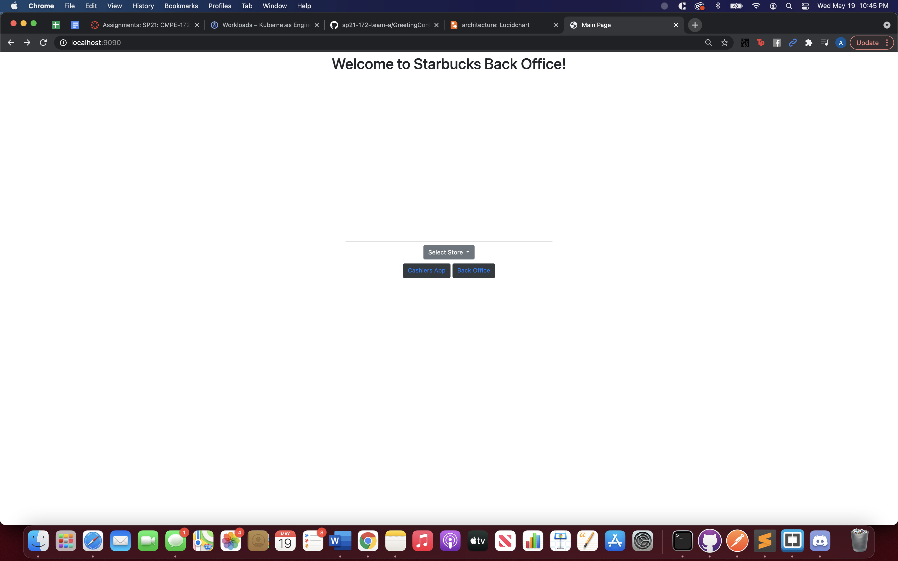
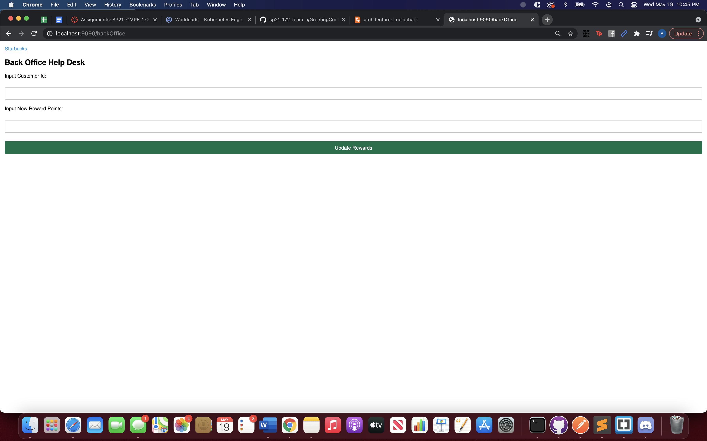

### Online Store

### REST API 
Our Rest API did not implement the @RestController as we separated the manual annotations into GetMapping/PostMapping and subsequent @ResponseBody if necessary as this allowed us to be more lexible with our model and variables. We implemented several API calls but were only able to demonstrate GET Customer and DELETE Customer due to the database functionality tied in with the UI.
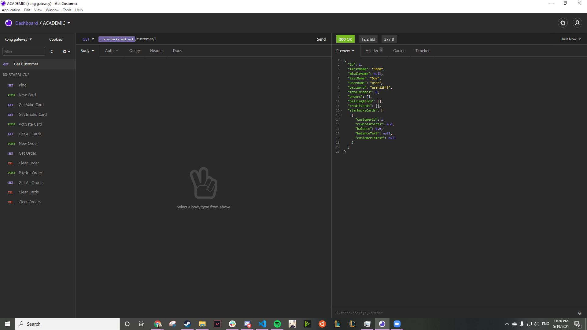
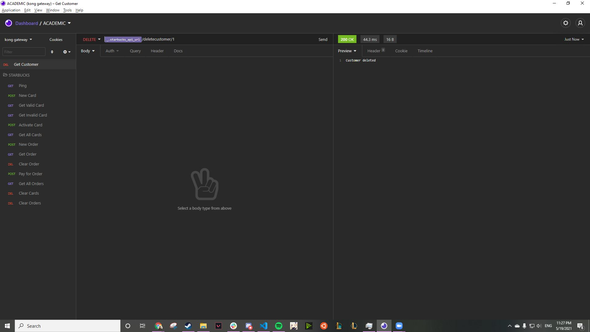

### Integrations
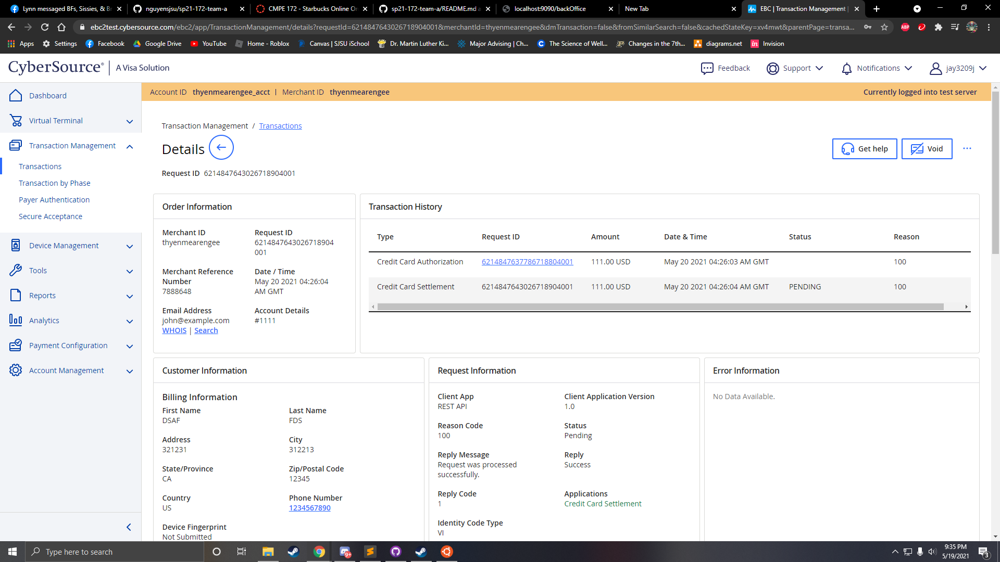
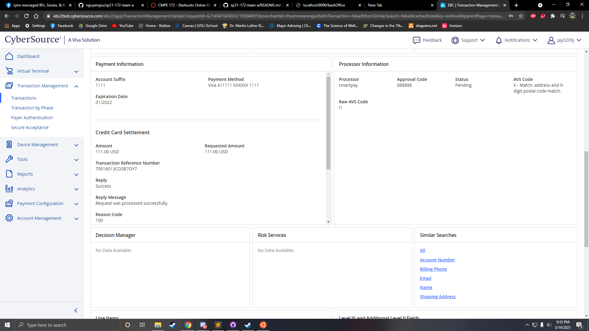
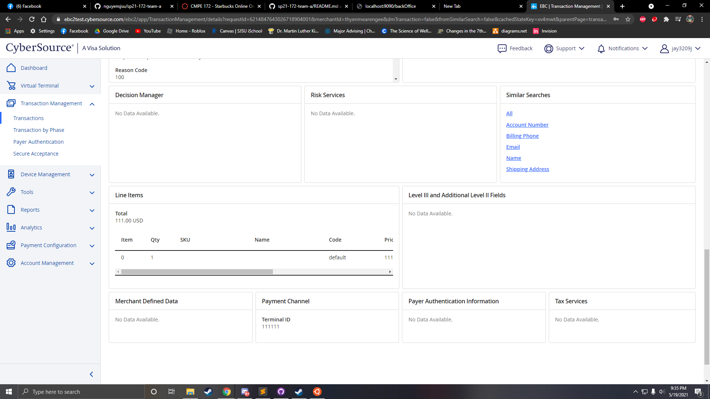

### Cloud Deployments
Secrets
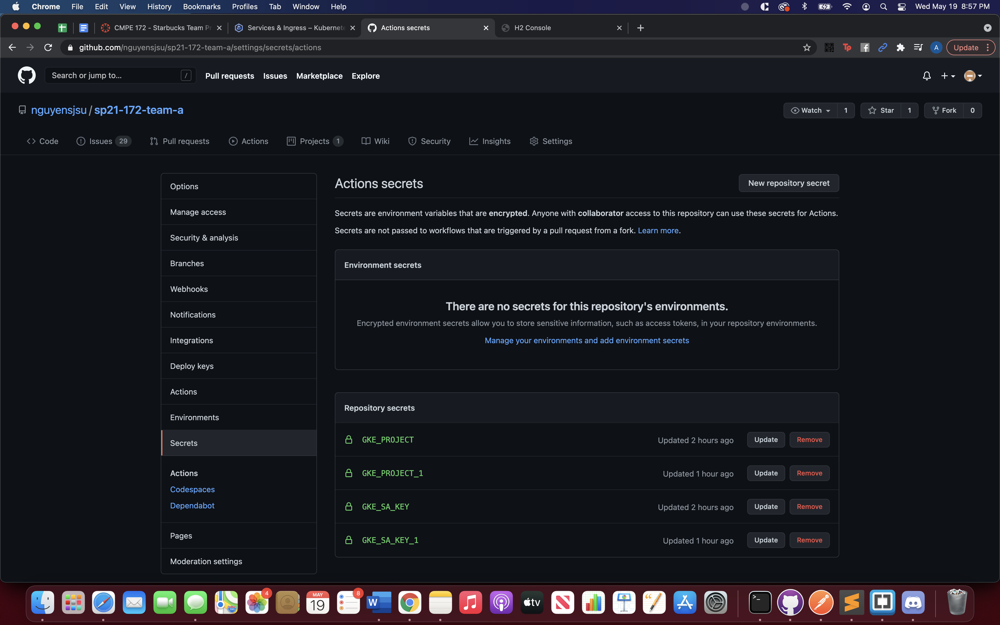

Cashier App deployed
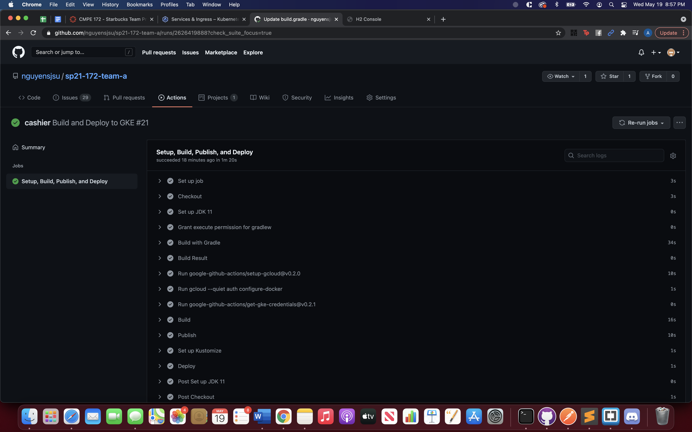

Cashier workload
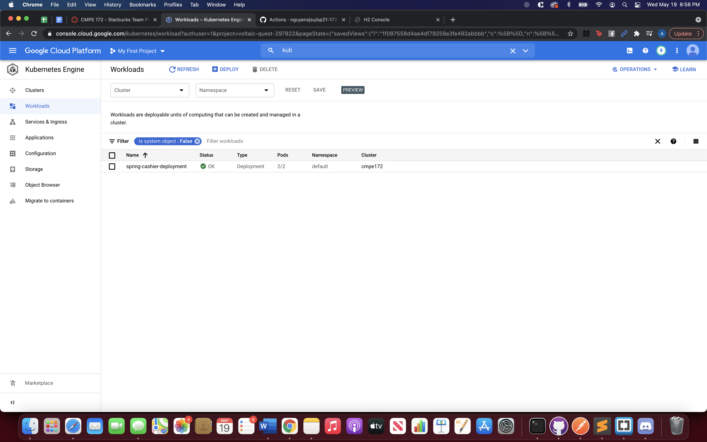
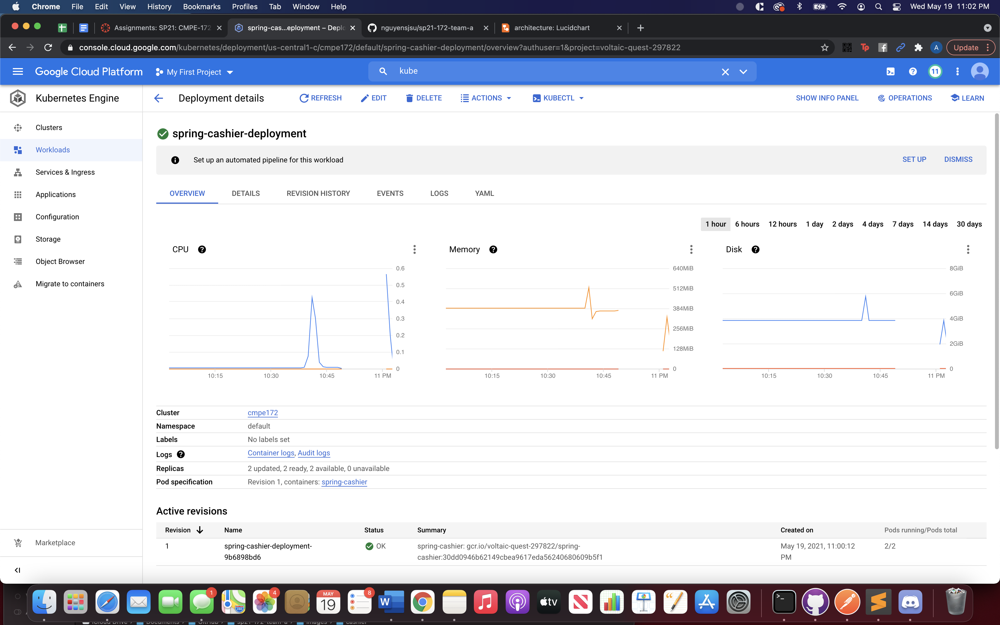

Cashier Ingress
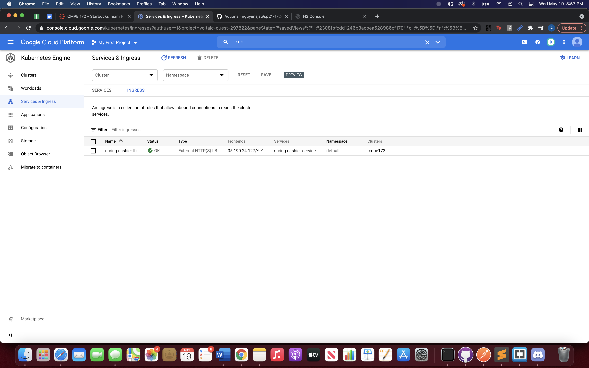

Cashier Service
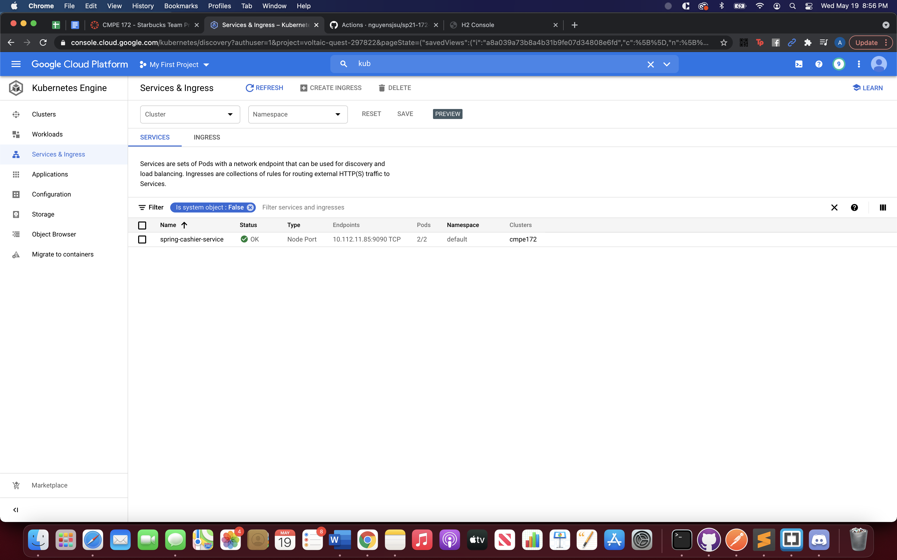
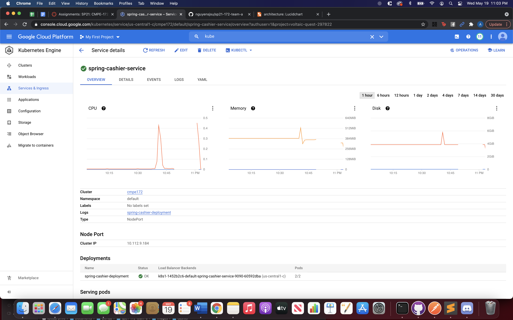

Customer App deployed

Customer workload
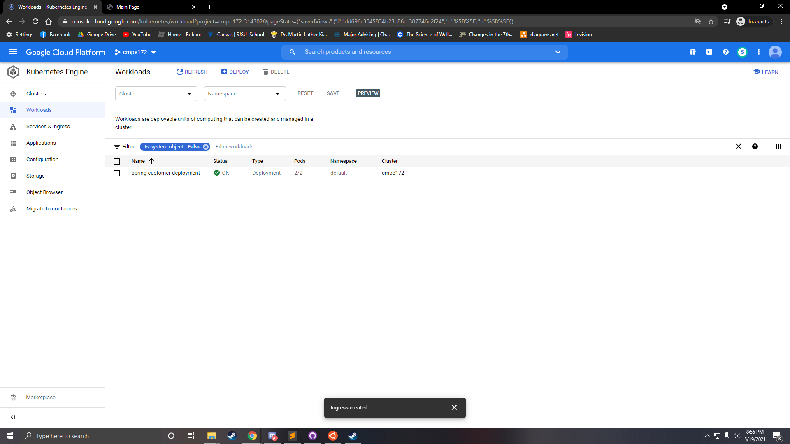

Customer Ingress
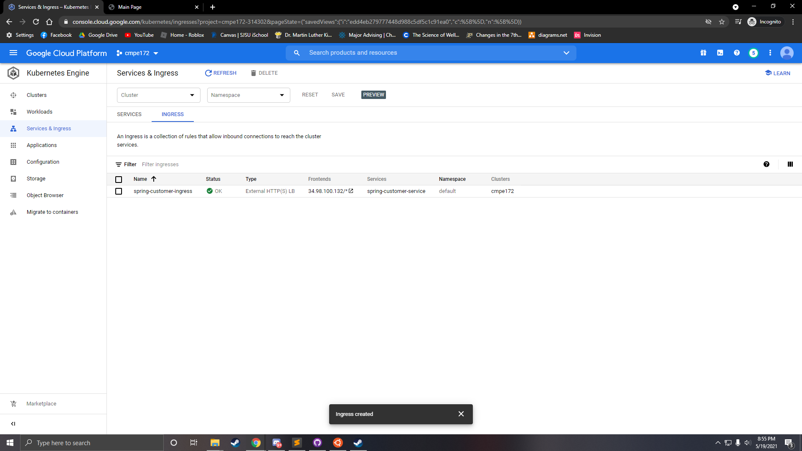

Customer Service
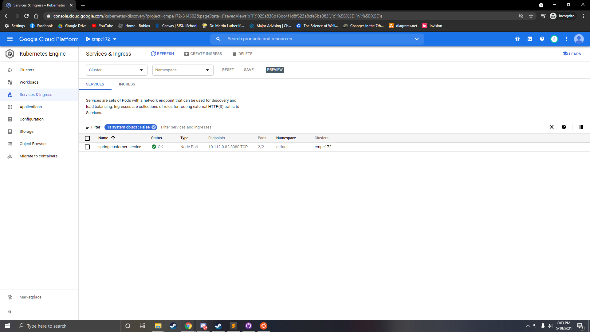
