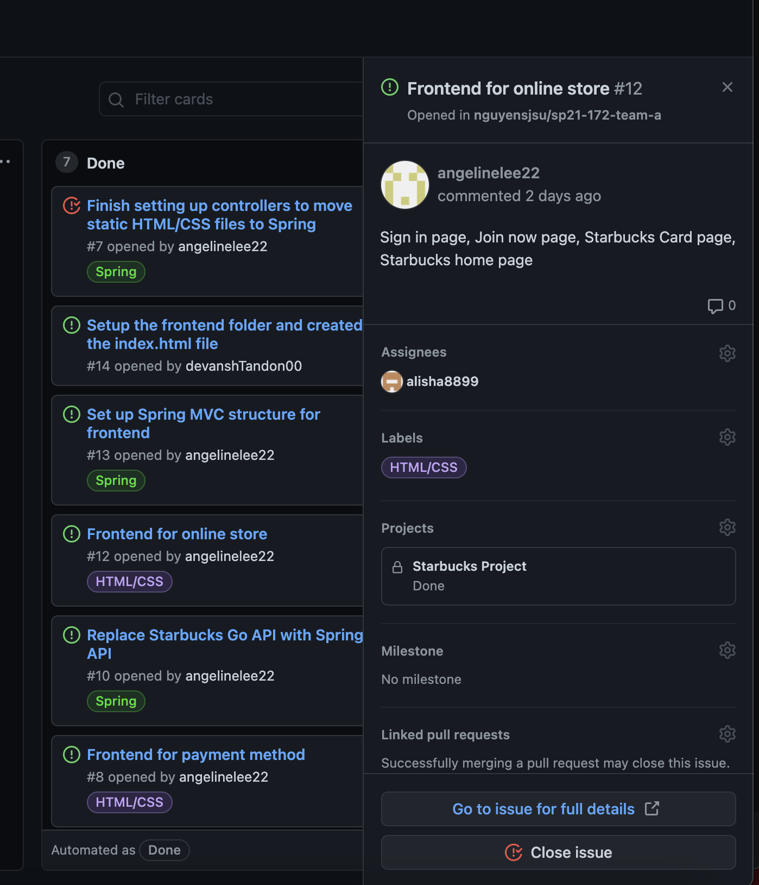

# Week #1 Status Report

### Snapshot
Below is an image of this week's task board:

### Accomplishments
Our team met last week to begin discussing the details of this project. We decided our meeting times and set up some goals to complete for week 1. We began by completing the front end using HTML/CSS. This would really help us see our results when working on backend. 

**Cards:**

1) Created Starbucks home page, Cards, Sign In, and Join Now page [Commit](https://github.com/nguyensjsu/sp21-172-team-a/commit/bf684b0d460fbcd51442b05d70c448cb9315c059#diff-99cadc3cdfb90d0be228037f48f52b745de6f3b4ff09c1046bd873c91089e6d5)

We all worked on creating the frontend for our project except for Angeline. I personally created the home page which would allow the user to go to these pages: Menu, Rewards, Cards, Sign In, Join Now. I created the sign in page and connected it to the Join Now page. The users can also view their starbucks card, which will soon be connected to the payment page. Next week, I will be working on the Rewards system. 

### Challenges
One of the first challenges we faced was understanding the project properly. We had 2 meetings to sit and discuss all the components of the project. As we talked about it, we were able to break up the components for the first week tasks. We learned that there are tasks that no one has prior knowledge about, and we will have to learn some new concepts. We had another meeting to break up the tasks for next week as well. 

