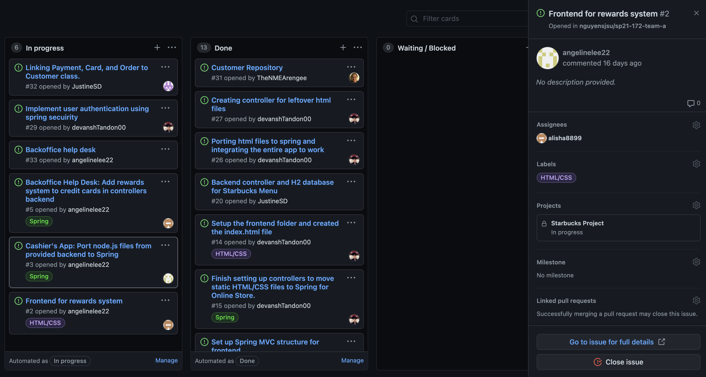

# Week #2 Status Report

### Snapshot
Below is an image of this week's task board:

### Accomplishments
Our team met last week to begin discussing the second weeks tasks. We split up the work into multiple components and assigned everyone different tasks. We broke up each of the tasks into 2 portions so everyone could work towards smaller goals. We were able to complete all of the frontend portion. We have a few pages that need to be updated, but we should be done by next week. 

**Cards:**

1) Created Starbucks Rewards Page [Commit](https://github.com/nguyensjsu/sp21-172-team-a/commit/ee69b030345f466623217010b1cfbc3929ed4a18)

I personally was assigned the front end component of the rewards system, along with the backend functionality where we can add rewards to credit cards in controller backend. I did not completely finish the backend functionality, as I needed the paymentmethod to be completed in order for me to calculate the rewards per customer. We also realized that we needed to build our customer files along with transaction functionality before adding a rewards system. So the goal for this upcoming week will be to complete that part, and linking it to the rewards functionality. 

### Challenges
One of the first challenges I faced was trying to build the rewards system without the paymentmethod completed. I was still able to finish some skeleton code completed, which I will finish this upcoming week as our payment method is working. As a team we faced an issue where we did not merge our last week's menufrontend branch into the main branch. We had some trouble pushing everything into main, as Github threw errors. We were able to get on a call and work together to push everything into main. We agreed that we would push our individual branch changes every week into main so we have main updated and working. 

