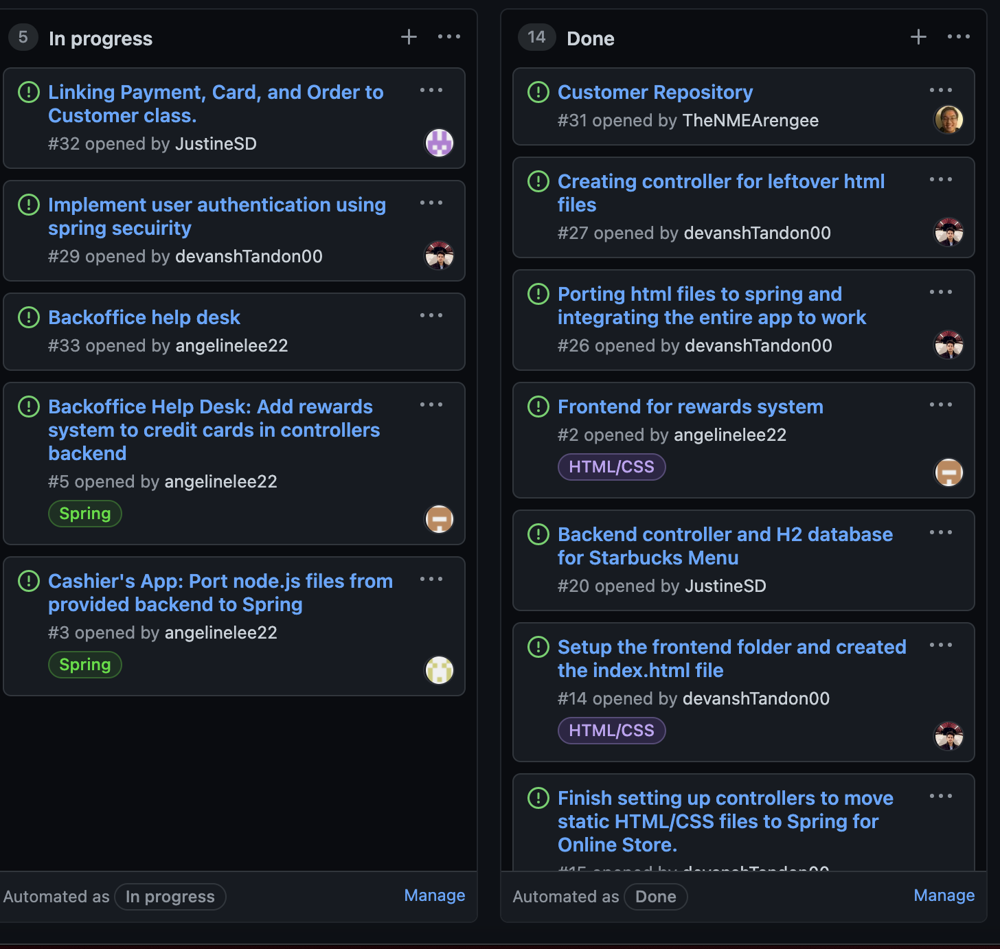

# Week #3 Status Report

### Snapshot
Below is an image of this week's task board:

### Accomplishments
This week our team was confused about the functionality of cashiers app and how to combine it with the other applications. We worked towards understanding which components first needed work, in order for other components to work.

**Cards:**

1) IN PROGRESS - Using ThymeLeaf to connect the "Redeem Here" button with the Reward Points Controller[Commit](https://github.com/nguyensjsu/sp21-172-team-a/commit/a8a1291c9435d56b7d785f1d4e8ca9c76e39faae)

2) IN PROGRESS - Writing functionality to add reward points into the starbucks order. Waiting for order payment to process then can be added into same file. 

### Challenges
I faced a similar challenge this week as the "make an order" task is still in progress. We are working towards finishing that, and once it is completed, I can add my functionality to count and display the reward points. We added addRewards and removeRewards in the StarbucksCard, as this will be keeping track of our rewards system. 
Due to Senior project being due this week, I wasn't able to complete a lot of work, however, for this upcoming week, this project is our number one priority. 

