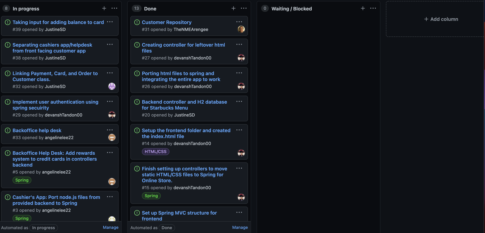

# Week #4 Status Report

### Snapshot
Below is an image of this week's task board:

### Accomplishments
This week I was able to get more clarity during office hours regarding our project goals. As a team we were able to complete the database to store all the customer information, along with getting a payment system working. 

**Cards:**

1) IN PROGRESS - I created the backoffice help desk and added it to our cashiers app. The html page can retrieve information and display it, so the barista's will know a customers previous orders. I will be adding a button for barista's to change the reward amount over the next two days. [Commit](https://github.com/nguyensjsu/sp21-172-team-a/commit/5e7fbbb74e995b80c0cb9c1180a2c1ccf9081ad7)

2) I worked on creating a login system with Devansh for the customer's front end using spring-security.

### Challenges
I still have not been able to add a rewards system because we haven't completed making an order and associating it with a customer ID. We have finished this task today, so I will add a rewards object tomorrow so each customer can add their points. I had some trouble figuring out how to display the customer data on the front end page, but I was able to figure it out with the help of the team. 