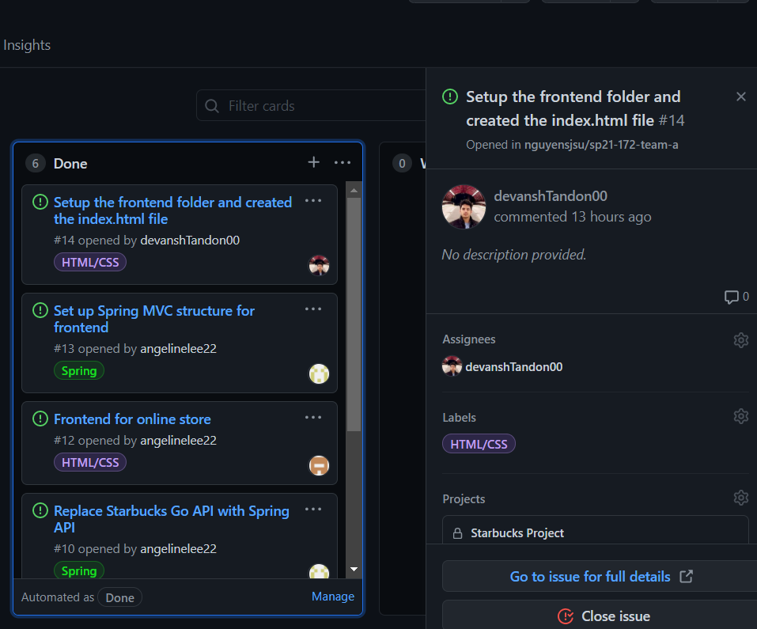

# Week #1 Status Report

### Snapshot
Below is an image of this week's task board:

### Accomplishments
For the Week#1 our team finally got started with our starbucks project. We were able to set up the foundation for the project, divide the responsibilities and worked with our teammates efficiently. Individually, I worked on creating the home page for our application. We also divided our work to have constant progress for week #2. 

**Cards:**

1)
[Created a index.html page](https://github.com/nguyensjsu/sp21-172-team-a/commit/e84f37c7348a9715fcc383e8f869a63bfc1380c0#diff-1871fc7d48e49a8b5e54149bb3d277640eb0818d14aed00b20ebc52a3f81e3db) 
[Updates](https://github.com/nguyensjsu/sp21-172-team-a/commit/43fe5a63009abad0cc8b933496637b7aba18117b#diff-1871fc7d48e49a8b5e54149bb3d277640eb0818d14aed00b20ebc52a3f81e3db)

Created a index.html page using HTML and CSS to show the main page of our application that lets the user select the store. I created a static page and will create it dynamic in the next week. In the next week, I will also create controller files for the HTML/CSS from Spring. 

### Challenges
This week we were understanding each others schedules and availability. We also spent a lot of the time understanding the requirements of our project and setting up the scope. Other than that, we did not have very complex challenges as the techical requirements we set were atainable. However, in the coming weeks, we will have to solidify our concepts to have a solid grasp to succeed in our project. 
