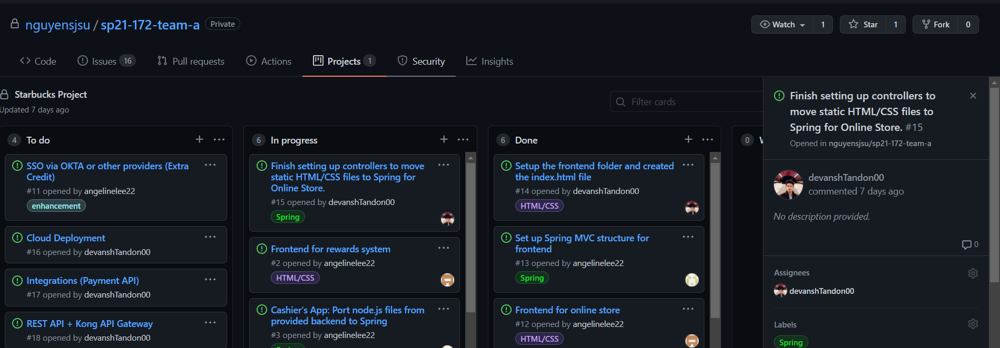

# Week #2 Status Report

### Snapshot
Below is an image of this week's task board:

### Accomplishments
For the Week#2 our team mostly worked individually on the 'menufrontend' branch. I worked primarily on porting over the HTML/CSS files to spring template format and establishing a connection between them and making sure that they work. I added all the HTML files under the templates folder (spring-cashier\src\main\resources\templates) and the CSS files as well as the images under the static folder (spring-cashier\src\main\resources\static). I also created the greeting controller. As for next week, we will be meeting after class today to decide what to work on. 

**Cards:**

1) [Commit history](https://github.com/nguyensjsu/sp21-172-team-a/commit/0bc8e4b4251c88867abc4fdd2246422ae0753b73#diff-71fe9ec73707401fc84943f9ac5a653f33f889e4900e6e910f6722ef4f58cc50)

### Challenges
I was a bit overwhelmed at the beginning as I struggled to create the controller and port the files over to Spring format utilizing Thymeleaf. 
It was also a bit challenging to link the files together and make it all work. Our team also faced issues with Git in general which caused a lot of merge conflicts and missing files and we all figured it out by working as a team. 
