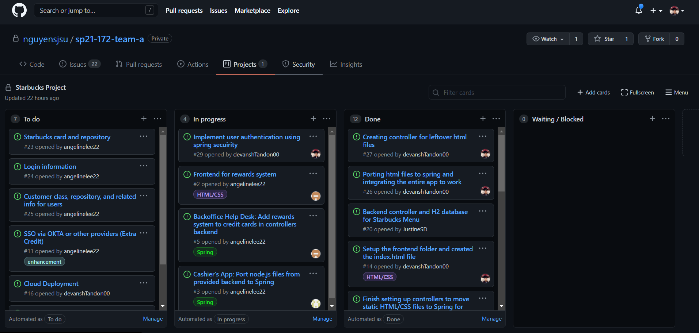

# Week #3 Status Report

### Snapshot
Below is an image of this week's task board (I worked on #26, #27 and #29):

### Accomplishments
For the Week#3 I created a branch devansh/week3 which dealt with working with integrating all the changes. I continued to work on porting over the HTML/CSS files to thymeleaf format and establishing a connection between them and making sure that they work. I also creating the respective controllers that were needed. After I was done with the devansh/week3 branch, I created a pull request and merged the changes to main. I created another branch to work on further functionality for this week as well as the next on the branch devansh/login. I will be working on user authentication using spring-secuirity on this branch.

**Cards:**

1) [Pull Request and Merge](https://github.com/nguyensjsu/sp21-172-team-a/commit/3ec17e0b3e94bd521d08890cc954b2c38a1298f8)
2) [devansh/login](https://github.com/nguyensjsu/sp21-172-team-a/commit/6f33fc5a4cb8f2d1c8aba8d441e988585245b0e7)

### Challenges
I am finally getting better at understanding the requirement and implementing functionality. The only challenge will be to successfully authenticate users with spring secuirity. 
