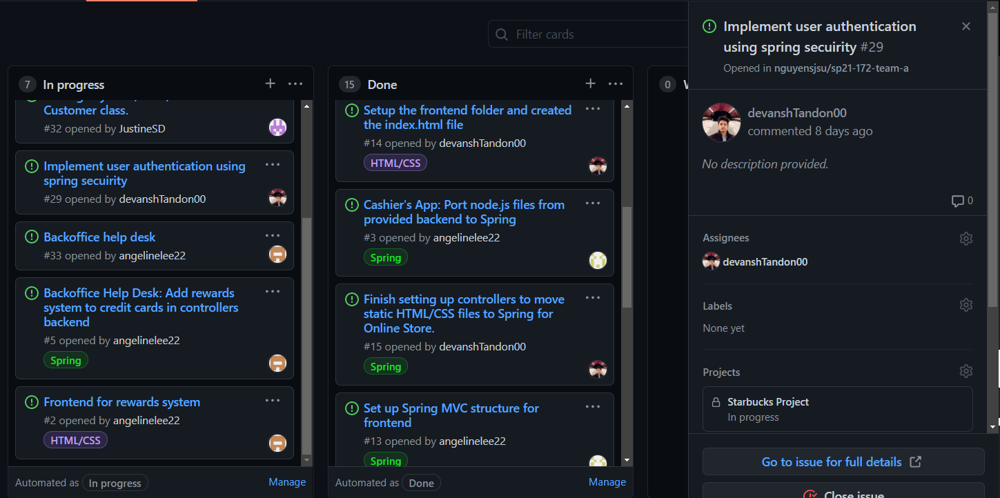

# Week #4 Status Report

### Snapshot
Below is an image of this week's task board (I worked on #26, #27 and #29):

### Accomplishments
For the Week#4 I created a branch devansh/login and devansh/newLogin. I worked with Alisha on the first branch and the spring security material. This week was a little harsh in respect to school and I was unable to get as much work as I would have wished to gotten done. I ran into some complications with spring security and this is still in progress. I am hoping to get done in the next day or two and integrate the functionality into the main branch.

**Cards:**

1) [devansh/newLogin](https://github.com/nguyensjsu/sp21-172-team-a/commit/96cad216a7a3d6885fd6426757a38820cc8f7338)
2) [All activity](https://github.com/nguyensjsu/sp21-172-team-a/compare/devansh/newLogin)

### Challenges
I am finally getting better at understanding the requirement and implementing functionality. 
