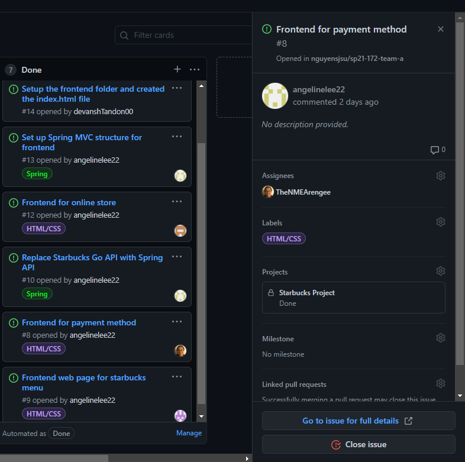
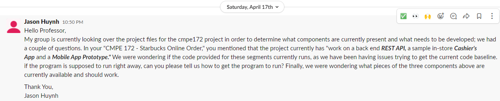

# Week #1 Status Report

### Snapshot
Below is an image of this week's task board:

### Accomplishments
Week 1 was Team A's first week working together. As such, a majorit6y of the work performed today comprised of determining the overall scope of the project as well as figuring out everyone's work schedules and strengths and weaknesses. Week 1 was also comprised of creating the HTML and CSS pages for the project frontend.

**Cards:**

1) [Frontend for payment method](https://github.com/nguyensjsu/sp21-172-team-a/commit/e2b5f9415813af689ddd7e7d6332fc185bb132e8)

Week 1's assignments comprised of Angeline figuring out how to port the base caode to Spring while everyone else was tasked with creating the HTML frontend pages for the project. The page that I was assigned to create was the payment method screen. This was ultimately accomplished by lifting the HTML code from the midterm 1 project and tweaking the fields to match those of a traditional credit card payment method screen. 

### Challenges
One of the primary challenges this week was trying to determine the extend of the work required for the project. We were all confused at the contents of the starter code as well as what we were supposed to add or change as well as what was supposed to be able to run or not. We ultimately resolved this by talking it through with each other as well as consulting the professor. I was assigned with creating the message to the professor containing our queries, as seen below

