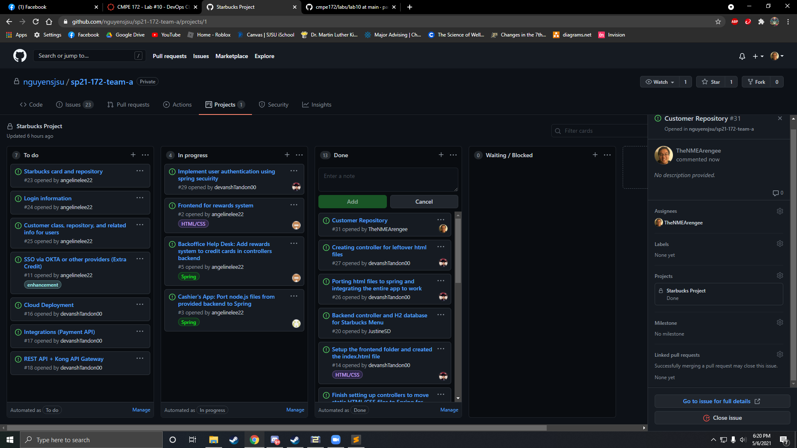

# Week #4 Status Report

### Snapshot
Below is an image of this week's task board:

### Accomplishments
Week 4 was primarily spent reformatting code for the database elements and creating the final components required for StarbucksCard.

**Cards:**

1) [Starbucks Card Payment Method](https://github.com/nguyensjsu/sp21-172-team-a/commit/8809114e72a65301e18992ab175b56ed986aaf55)

This commit composed of creating the function to fill up a Starbucks Card with the user's credit card. This commit also features work that both Alisha and I have made on the backoffice help desk 
The Starbucks Card Filling Function was created by:
- porting all of the CyberSource files from lab 7
- reconfiguring them to fit with our StarbucksCard object
- removing the Thymeleaf creation form input and post processing

The backoffice help desk currently displays all Starbucks Cards stored in the database, which was created by:
- repurposing the ErrorMessages class into a DatabaseMessages inner class and passing all of the database content to that class

### Challenges
One of the primary challenges that was met was trying to get the filling method for Starbucks Cards to work properly. This was caused by:
- trying to have an Error type object in the method call for the POST method, as only the @ModelAttribute object was removed
Removing this object from the method call resolved this issue

