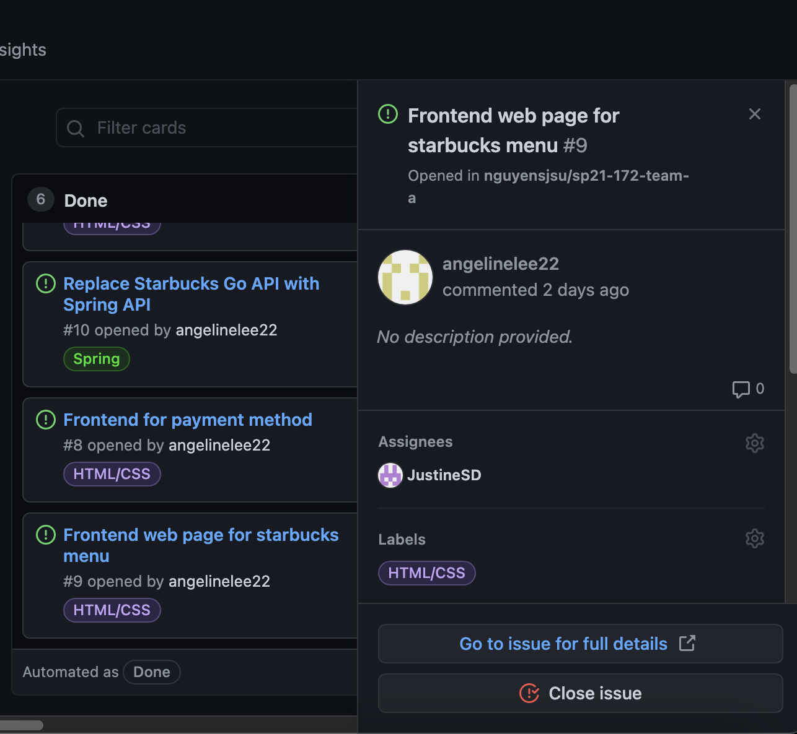

# Week #1 Status Report

### Snapshot
Below is an image of this week's task board:

### Accomplishments
This past week we were able to have consistent meetings and work out effective plans for how we were to complete the project. We agreed that the first thing to do was to set up the frontend using HTML/CSS so that we would be able to have something up and running after working on the backend

**Cards:**

1) Created simple menu page using HTML and CSS [Commit](https://github.com/nguyensjsu/sp21-172-team-a/commit/13ad3a1492eecbe834f5bb318c0a7cae0f2eea4a)

Everyone on the team except Angeline was responsible for creating one of the frontend pges needed for the Starbucks app to function. I was responsible for making the menu page which allows the user to choose between four drinks, whether they want milk or not, and the size of their drink. In the coming week I will be setting up the backend so that the menu page can actually take inputs from the user.

### Challenges
In our first week we were still getting to know each other and our schedules. Our biggest challenge for the first week was going through the assignment page and github repo to decipher what we actually needed to do. Due to our relative lack of experience in certain areas of the project we will have to learn new concepts going forward.

