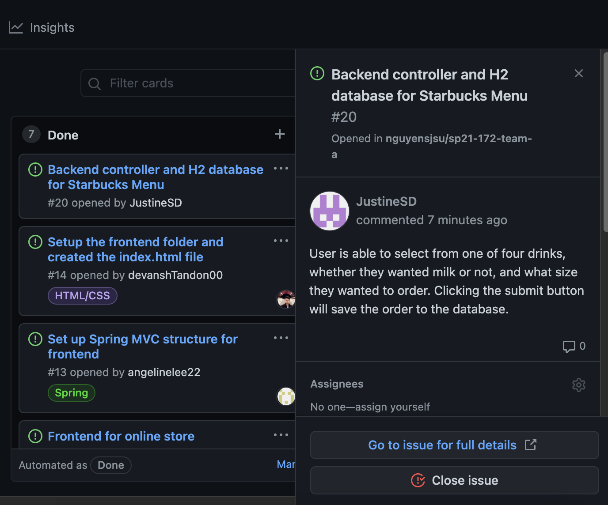

# Week #2 Status Report

### Snapshot
Below is an image of this week's task board:

### Accomplishments
This past week I was able to link the html page to the controller on spring through thymeleaf. I made a repository using JPA and saved data inputted on the HTML page to an H2 database.

**Cards:**

1) Linked HTML and MenuController allowing user to place an order and have it saved into the database. [Commit](https://github.com/nguyensjsu/sp21-172-team-a/commit/33f6670086faece071a01430ead9dd58b77c5db1)

This week I was responsible for the backend design of the drinks menu for the app. This included the user being able to select from one of four drinks, whether they wanted milk or not, and what size they wanted to order. Clicking the submit button will save the order to the database.

### Challenges
There were some challenges in regards to correctly linking the HTML forms and the controller. I had to search what was the best way of using thymeleaf with a drop down list. I also had to learn how to link specific html files to different parts of the controller.

