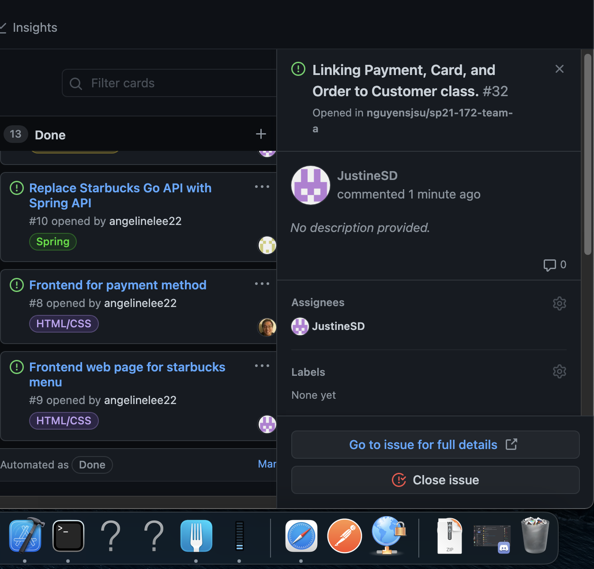

# Week #3 Status Report

### Snapshot
Below is an image of this week's task board:

### Accomplishments
This past week I worked with Jason to start connecting all the different classes such as cards, payment options, and orders and linking them to the individual customer objects via universal customer IDs. I also assisted Devansh in starting the registration and login processing.

**Cards:**

1) Linking cards, payment options, and orders to the customer object. [Commit](https://github.com/nguyensjsu/sp21-172-team-a/commit/07290275c909fcc768cce1185ca4f6dadc2cd3e0)

### Challenges
When it came to linking objects within the h2 database Jason and I had to do research outside of what we learned in class. We found using the @Embedded, @ElementCollection, and @CollectionTable suited our needs when it came to linking objects in the h2 database.

