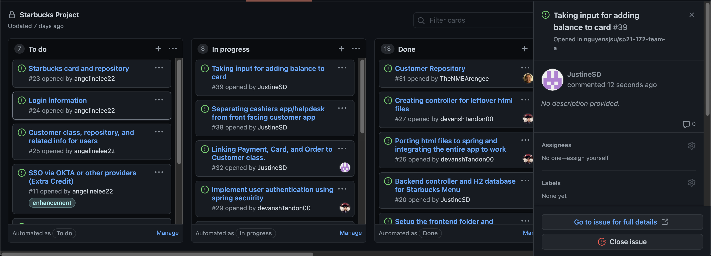

# Week #4 Status Report

### Snapshot
Below is an image of this week's task board:

### Accomplishments
I worked on separating the files into individual front end customer facing and cashier/backend apps. I also worked on modifying the starbucks card page to accept an input from the user on how much money they would like to add to their card.

**Cards:**

1) Separating the two apps. [Commit](https://github.com/nguyensjsu/sp21-172-team-a/commit/06dae76bd592efbd6e481665e8c1fbf013729f05)

1) Modifying starbucks cards [Commit](https://github.com/nguyensjsu/sp21-172-team-a/commit/1f48beb7546f7ffe3e128d371ca996a528be5939)

### Challenges
One big challenge was separating all these files that had so many interdependencies. Many classes needed each other to run even though they were meant to be either for the customer facing frontend or the cashiers app. We will need to learn how to persist all this data on a central database and allow data to be easily accessed by either app

